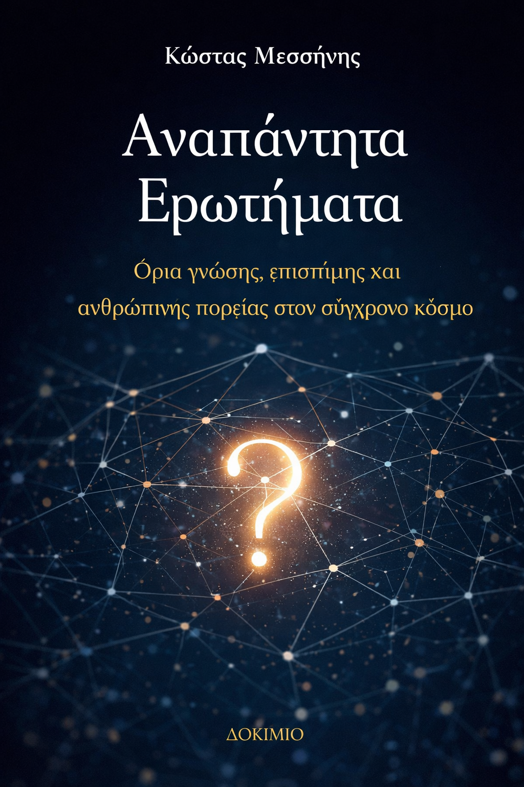

<h1> Αναπάντητα Ερωτήματα</h1>

<h2> Όρια γνώσης, επιστήμης και ανθρώπινης πορείας στον σύγχρονο κόσμο</h2>

<code>
© 2025 Κώστας Μεσσήνης
Με επιφύλαξη των ηθικών δικαιωμάτων του συγγραφέα. 
Το παρόν έργο διατίθεται υπό την άδεια
Creative Commons Αναφορά – Μη Εμπορική Χρήση – Όχι Παράγωγα Έργα 4.0 Διεθνές (CC BY-NC-ND 4.0). 
Επιτρέπεται η αναπαραγωγή και διανομή του έργου για μη εμπορικούς σκοπούς, υπό την προϋπόθεση ότι αναφέρεται ο δημιουργός και δεν γίνονται τροποποιήσεις ή παράγωγα έργα. 
Για κάθε άλλη χρήση απαιτείται προηγούμενη έγγραφη άδεια του συγγραφέα. 
Το έργο αποτελεί πρωτότυπη πνευματική δημιουργία. Οι απόψεις που εκφράζονται είναι του συγγραφέα και δεν δεσμεύουν κανέναν φορέα ή οργανισμό. 
Τίτλος: Αναπάντητα Ερωτήματα 
Συγγραφέας: Κώστας Μεσσήνης 
Έτος έκδοσης: 2025</code>    

# Εκτελεστική Σύνοψη

Το παρόν έργο, με τίτλο «Αναπάντητα Ερωτήματα», εξετάζει συστηματικά τα όρια της γνώσης, της επιστήμης και της ανθρώπινης πορείας στον σύγχρονο κόσμο. Αντικείμενό του δεν είναι η παροχή οριστικών απαντήσεων, αλλά η χαρτογράφηση των ερωτημάτων που παραμένουν ανοιχτά είτε λόγω εγγενών θεωρητικών περιορισμών είτε λόγω κοινωνικών, θεσμικών και αξιακών εντάσεων.

Η βασική θέση του έργου είναι ότι τα αναπάντητα ερωτήματα δεν αποτελούν αποτυχία της γνώσης ή ένδειξη καθυστέρησης της προόδου.
 Αντίθετα, συνιστούν δομικό στοιχείο τόσο της επιστημονικής διερεύνησης όσο και της κοινωνικής οργάνωσης. Η κατανόηση της φύσης αυτών των ερωτημάτων είναι απαραίτητη για τη διαμόρφωση υπεύθυνων πολιτικών, τεχνολογικών και θεσμικών αποφάσεων.

Στόχος και προσέγγιση

Στόχος του βιβλίου είναι η σαφής διάκριση ανάμεσα:

<ul><li>Στα ερωτήματα που δεν έχουν ακόμη απαντηθεί.</li>
<li>Στα ερωτήματα που δεν μπορούν να απαντηθούν με τους ίδιους όρους.</li>
<li>Και στα ερωτήματα που αποφεύγονται συστηματικά λόγω πολιτικού, κοινωνικού ή θεσμικού κόστους.</li></ul>

Η προσέγγιση είναι διεπιστημονική, χωρίς να συγχέει τα πεδία. Το έργο διατηρεί σαφή όρια ανάμεσα στη φιλοσοφική, κοινωνική και επιστημονική ανάλυση, ενώ παράλληλα αναδεικνύει τα σημεία σύγκλισης και αλληλεπίδρασής τους.
 <> Δεν προτείνεται ως ακαδημαϊκό εγχειρίδιο εξειδίκευσης, αλλά ως εννοιολογικό και θεσμικό πλαίσιο κατανόησης.

Δομή και βασικοί άξονες.

Το βιβλίο οργανώνεται σε τρία κύρια μέρη:

### Α. Αναπάντητα ερωτήματα της ανθρώπινης πορείας

Εξετάζονται θεμελιώδη ζητήματα φιλοσοφίας, κοινωνικής οργάνωσης και οικονομίας.

Αναλύονται έννοιες όπως:

<ul>
<li>η πρόοδος και τα όριά της,</li>
<li>η σχέση ελευθερίας, ευθύνης και εξουσίας,</li>
<li>η δημοκρατία ως θεσμός ή διαδικασία,</li>
<li>η ανισότητα και η κοινωνική συνοχή,</li>
<li>η εργασία και η αξία στον 21ο αιώνα.</li>
</ul>

 Το κεντρικό συμπέρασμα αυτού του μέρους είναι ότι πολλά κοινωνικά ερωτήματα παραμένουν αναπάντητα όχι λόγω έλλειψης γνώσης, αλλά επειδή εμπλέκουν αντικρουόμενες αξίες και συλλογικές επιλογές που δεν μπορούν να επιλυθούν τεχνικά.

### Β. Αναπάντητα επιστημονικά ερωτήματα

> Αναλύεται τι συνιστά επιστημονικό ερώτημα και πώς δομείται η επιστημονική γνώση μέσω θεωριών, μοντέλων και υποθέσεων. Εξετάζονται ενδεικτικά:
- τα θεμελιώδη ανοιχτά προβλήματα των φυσικών επιστημών,
- η προέλευση της ζωής και η συνείδηση στη βιολογία,
- τα όρια της υπολογισιμότητας και της τεχνητής νοημοσύνης.
> Το έργο δείχνει ότι τα αναπάντητα επιστημονικά ερωτήματα δεν είναι περιφερειακά, αλλά βρίσκονται στον πυρήνα των πιο επιτυχημένων θεωριών. Η ύπαρξή τους υποδεικνύει όρια της μεθόδου και όχι απλώς έλλειψη δεδομένων.

### Γ. Επιστήμη, τεχνολογία και κοινωνία

> Το τελευταίο μέρος εστιάζει στη συνάντηση της επιστημονικής γνώσης με την κοινωνική και πολιτική πραγματικότητα. Αναδεικνύονται:
- η σχέση επιστήμης και πολιτικής απόφασης,
- τα ηθικά διλήμματα της τεχνολογικής ισχύος,
- και η έννοια της ευθύνης της γνώσης.
> Το βιβλίο υποστηρίζει ότι η επιστήμη δεν μπορεί να υποκαταστήσει τη δημοκρατική διαδικασία, ούτε η τεχνολογία να καθορίσει από μόνη της τους κοινωνικούς σκοπούς. Η αποσαφήνιση αυτών των ορίων αποτελεί προϋπόθεση θεσμικής νομιμοποίησης.

### Κεντρικά συμπεράσματα

> Από τη συνολική ανάλυση προκύπτουν ορισμένα βασικά συμπεράσματα: 
1. Τα αναπάντητα ερωτήματα είναι αναγκαία για τη δυναμική της γνώσης και της κοινωνίας. 
2. Η σύγχυση ανάμεσα στην άγνοια και στα όρια οδηγεί είτε σε τεχνοκρατική υπερεκτίμηση είτε σε σκεπτικισμό. 
3. Η επιστημονική πρόοδος δεν εξαλείφει την αβεβαιότητα· τη μετασχηματίζει. 
4. Η τεχνολογία αυξάνει την ισχύ, όχι κατ’ ανάγκη την κατανόηση. 
5. Η ευθύνη της γνώσης είναι θεσμικό και όχι μόνο ατομικό ζήτημα. 

### Θεσμική αξία του έργου

> Το βιβλίο μπορεί να αξιοποιηθεί:
- ως πλαίσιο προβληματισμού για φορείς χάραξης πολιτικής,
- ως εισαγωγικό υλικό σε διεπιστημονικά προγράμματα,
- ως βάση δημόσιου διαλόγου για επιστήμη, τεχνολογία και κοινωνία.
> Δεν προτείνει λύσεις πολιτικής ούτε τεχνικές συνταγές. Προσφέρει, όμως, εννοιολογική καθαρότητα, διάκριση ρόλων και συνειδητοποίηση ορίων — στοιχεία απαραίτητα για υπεύθυνη λήψη αποφάσεων σε περιβάλλον αβεβαιότητας.

 <b>Τελική αποτίμηση </b>

>> <i>Η Εκτελεστική Σύνοψη καταδεικνύει ότι το έργο «Αναπάντητα Ερωτήματα» δεν αποτελεί συλλογή ανοιχτών προβλημάτων, αλλά συνεκτικό πλαίσιο σκέψης. Η κεντρική του συμβολή έγκειται στην αποδοχή της αβεβαιότητας ως θεσμικής και γνωσιακής συνθήκης, και όχι ως προσωρινής ανεπάρκειας.Σε έναν κόσμο όπου η απαίτηση για γρήγορες και οριστικές απαντήσεις εντείνεται, το έργο υποστηρίζει ότι η υπεύθυνη γνώση ξεκινά από την αναγνώριση των ορίων της. Αυτό το σημείο αποτελεί και τη βασική του θεσμική αξία.</i>

## Πρόλογος

> Το παρόν έργο ξεκινά από μια απλή αλλά κρίσιμη διαπίστωση: παρά τη συσσώρευση γνώσης, δεδομένων και τεχνολογικών δυνατοτήτων, ο σύγχρονος κόσμος εξακολουθεί να περιβάλλεται από ερωτήματα που είτε δεν έχουν απαντηθεί είτε δεν μπορούν να απαντηθούν με τον τρόπο που συνήθως τα διατυπώνουμε. 
> Τα ερωτήματα αυτά δεν ανήκουν σε ένα μόνο πεδίο. Διατρέχουν τη φιλοσοφία, την κοινωνία, την οικονομία, την τεχνολογία και την επιστήμη. Άλλα αφορούν το νόημα και την κατεύθυνση της ανθρώπινης πορείας, και άλλα τα όρια της επιστημονικής γνώσης και της θεωρητικής μας κατανόησης. Το βιβλίο αυτό επιχειρεί να τα προσεγγίσει όχι ως αδυναμίες, αλλά ως δομικά χαρακτηριστικά της ανθρώπινης σκέψης και οργάνωσης. 

#### Γιατί τα ερωτήματα παραμένουν αναπάντητα ;

> Τα αναπάντητα ερωτήματα δεν υπάρχουν επειδή «δεν έχουμε προοδεύσει αρκετά». Υπάρχουν επειδή ορισμένα προβλήματα είναι πολυεπίπεδα, αξιακά ή θεσμικά φορτισμένα, και δεν επιδέχονται μονοσήμαντες λύσεις. 
> Σε κοινωνικό και φιλοσοφικό επίπεδο, πολλά ερωτήματα παραμένουν ανοιχτά επειδή:
εμπλέκουν αντικρουόμενες αξίες,
συγκρούονται με κυρίαρχα οικονομικά ή πολιτικά συμφέροντα,
ή απαιτούν συλλογικές αποφάσεις που καμία τεχνολογία δεν μπορεί να αντικαταστήσει.
> Σε επιστημονικό επίπεδο, τα ερωτήματα παραμένουν αναπάντητα όχι από έλλειψη προσπάθειας, αλλά επειδή: 
- τα υπάρχοντα θεωρητικά πλαίσια δεν επαρκούν,
- συνυπάρχουν ανταγωνιστικές θεωρίες με διαφορετικές ερμηνευτικές δυνάμεις,
- ή επειδή το ίδιο το ερώτημα αγγίζει τα όρια της μεθόδου. 
>Το βιβλίο αυτό δεν αντιμετωπίζει τα αναπάντητα ερωτήματα ως προσωρινά κενά που θα «γεμίσουν» αναπόφευκτα στο μέλλον, αλλά ως ενεργά σημεία έντασης, μέσα από τα οποία εξελίσσεται η γνώση, η κοινωνία και η επιστήμη. 

### Η διαφορά μεταξύ άγνοιας και ορίου

> Κεντρική θέση του έργου είναι ότι πρέπει να διακρίνουμε καθαρά την άγνοια από το όριο. Η άγνοια αφορά όσα δεν γνωρίζουμε ακόμη: ελλιπή δεδομένα, ανεπαρκή εργαλεία, προσωρινές θεωρητικές αδυναμίες. Η επιστήμη και η έρευνα κινούνται διαρκώς προς τη μείωσή της.
Το όριο, αντίθετα, αφορά όσα: 
- δεν μπορούν να περιγραφούν πλήρως από ένα δεδομένο θεωρητικό πλαίσιο,
- δεν είναι μετρήσιμα χωρίς να αλλοιωθεί το αντικείμενό τους,
- ή δεν επιδέχονται οριστική απάντηση χωρίς να εισαχθούν αξιακές ή φιλοσοφικές παραδοχές. 
> Η σύγχυση ανάμεσα στην άγνοια και το όριο οδηγεί είτε σε αφελή αισιοδοξία («όλα θα λυθούν με περισσότερη τεχνολογία») είτε σε στείρο σκεπτικισμό. Το παρόν βιβλίο προτείνει μια τρίτη στάση: τη συνειδητή αποδοχή των ορίων ως εργαλείο κατανόησης και υπευθυνότητας. 

### Σκοπός και κατεύθυνση του έργου

> Ο σκοπός του βιβλίου δεν είναι να δώσει απαντήσεις εκεί όπου δεν μπορούν να υπάρξουν, αλλά:
- να χαρτογραφήσει τα είδη των αναπάντητων ερωτημάτων,
- να διακρίνει τα κοινωνικά και φιλοσοφικά από τα αυστηρά επιστημονικά,
- και να δείξει πώς τα όρια της γνώσης επηρεάζουν την ανθρώπινη πορεία.
> Με αυτή τη διάρθρωση, τα Αναπάντητα Ερωτήματα αντιμετωπίζονται όχι ως αποτυχία της σκέψης, αλλά ως συνθήκη ωριμότητας: ως το σημείο όπου η γνώση συναντά την ευθύνη.

## Εισαγωγή

> Η εποχή μας χαρακτηρίζεται από μια παράδοξη συνθήκη: ποτέ άλλοτε η ανθρωπότητα δεν διέθετε τόση γνώση, τόσα δεδομένα και τόσα τεχνολογικά μέσα· και όμως, ποτέ άλλοτε δεν βρέθηκε αντιμέτωπη με τόσο θεμελιώδη και επίμονα ερωτήματα για το μέλλον, τη συνοχή και την κατεύθυνσή της. 
Η συνύπαρξη αυτής της γνωσιακής αφθονίας με τη βαθιά αβεβαιότητα δεν αποτελεί αντίφαση, αλλά ένδειξη ότι η γνώση δεν εξαντλεί το πεδίο της κατανόησης. 
Το παρόν βιβλίο ξεκινά από την παραδοχή ότι τα αναπάντητα ερωτήματα δεν είναι απλώς προσωρινά κενά που αναμένουν συμπλήρωση.  Αντίθετα, σε πολλές περιπτώσεις αποτελούν δομικά χαρακτηριστικά των κοινωνιών, των επιστημών και της ανθρώπινης σκέψης. Η επιμονή τους δεν δηλώνει αποτυχία, αλλά αποκαλύπτει τα όρια εντός των οποίων λειτουργεί η ανθρώπινη νόηση και δράση. 
Σκοπός της Εισαγωγής είναι να οριοθετήσει το πλαίσιο μέσα στο οποίο τα ερωτήματα αυτά θα εξεταστούν: όχι ως αινίγματα προς λύση, αλλά ως πεδία διερεύνησης που διαμορφώνουν την ίδια την έννοια της γνώσης και της ευθύνης. 

### Τι εννοούμε με τον όρο «Αναπάντητα Ερωτήματα»

> Ο όρος «αναπάντητο» χρησιμοποιείται συχνά με τρόπο ασαφή ή επιπόλαιο. Στο πλαίσιο του παρόντος έργου, δεν σημαίνει απλώς ότι «δεν γνωρίζουμε ακόμη». Αναφέρεται σε ερωτήματα που:
- δεν επιδέχονται μία και μοναδική απάντηση,
- δεν μπορούν να απαντηθούν χωρίς την εισαγωγή αξιακών ή φιλοσοφικών παραδοχών,
- ή μεταβάλλονται καθώς μεταβάλλεται το κοινωνικό και ιστορικό πλαίσιο. 
> Υπό αυτή την έννοια, τα αναπάντητα ερωτήματα δεν είναι στατικά. Αναδιατυπώνονται, μετατοπίζονται, επανεμφανίζονται με νέα μορφή. Το ερώτημα για την πρόοδο, για παράδειγμα, παραμένει ανοιχτό όχι επειδή δεν έχουν υπάρξει τεχνολογικές εξελίξεις, αλλά επειδή δεν υπάρχει καθολική συμφωνία για το τι συνιστά «πρόοδο» και ποιος δικαιούται να την ορίζει. 
Το ίδιο ισχύει και για πολλά επιστημονικά ερωτήματα: η ύπαρξη πολλαπλών θεωριών, η αδυναμία ενοποίησης πλαισίων ή τα εγγενή όρια της μέτρησης δεν αποτελούν απλές τεχνικές δυσκολίες, αλλά ενδείξεις βαθύτερων θεωρητικών ορίων. 

### Η διπλή φύση των ερωτημάτων: κοινωνική και επιστημονική

> Το βιβλίο διαρθρώνεται γύρω από μια βασική διάκριση: εκείνη ανάμεσα στα αναπάντητα ερωτήματα της ανθρώπινης πορείας και στα αναπάντητα επιστημονικά ερωτήματα. Η διάκριση αυτή δεν είναι απόλυτη, αλλά λειτουργική. 
> Τα πρώτα αφορούν ζητήματα νοήματος, αξιών, οργάνωσης και κατεύθυνσης. Εμπλέκουν τη φιλοσοφία, την πολιτική, την κοινωνιολογία, την οικονομία και την τεχνολογία. Δεν απαντώνται με πειράματα ή εξισώσεις, αλλά με δημόσιο διάλογο, ιστορική εμπειρία και συλλογικές αποφάσεις. 

> Τα δεύτερα αφορούν τη δομή της γνώσης, τα θεωρητικά πλαίσια και τις μεθόδους της επιστήμης.   Εδώ το πρόβλημα δεν είναι η έλλειψη δεδομένων, αλλά συχνά <b>η ανεπάρκεια των εννοιολογικών</b> εργαλείων με τα οποία προσεγγίζουμε την πραγματικότητα. Η ύπαρξη πολλών θεωριών για το ίδιο φαινόμενο δεν συνιστά αποτυχία της επιστήμης, αλλά ένδειξη ότι βρισκόμαστε κοντά στα όριά της. 
> Η διάκριση αυτή είναι κρίσιμη, διότι αποτρέπει μια συχνή σύγχυση: την τάση να αντιμετωπίζονται κοινωνικά ή ηθικά ερωτήματα ως τεχνικά προβλήματα, ή επιστημονικά αδιέξοδα ως απλή άγνοια που θα ξεπεραστεί αυτόματα με περισσότερη τεχνολογία.

### Επιστήμη, τεχνολογία και η ψευδαίσθηση της οριστικής απάντησης

> Ένα από τα βασικά κίνητρα του έργου είναι η ανάγκη να αμφισβητηθεί η ευρέως διαδεδομένη αντίληψη ότι η επιστημονική και τεχνολογική πρόοδος οδηγεί αναπόφευκτα στη σταδιακή εξάλειψη όλων των ερωτημάτων. Η αντίληψη αυτή, αν και ελκυστική, παραγνωρίζει το γεγονός ότι κάθε νέα απάντηση γεννά νέα ερωτήματα, συχνά πιο σύνθετα από τα προηγούμενα. 
Η τεχνολογία, ιδίως, τείνει να παρουσιάζεται ως ουδέτερο εργαλείο επίλυσης προβλημάτων. Στην πραγματικότητα, όμως, ενσωματώνει αξίες, προτεραιότητες και περιορισμούς. Τα ερωτήματα που εγείρει —σχετικά με την εργασία, την ιδιωτικότητα, την αυτονομία ή την εξουσία— δεν μπορούν να απαντηθούν με τεχνικούς όρους μόνο. 
Το βιβλίο επιχειρεί να δείξει ότι η αναγνώριση των ορίων δεν αποτελεί εμπόδιο στην πρόοδο, αλλά προϋπόθεση υπεύθυνης δράσης. Η αποδοχή ότι ορισμένα ερωτήματα θα παραμείνουν ανοιχτά δεν οδηγεί σε παραίτηση, αλλά σε <i>πιο ώριμες μορφές σκέψης και <b>λήψης αποφάσεων</b></i>. 

### Πώς να διαβαστεί αυτό το βιβλίο

Το έργο δεν προτείνεται ως εγχειρίδιο απαντήσεων, αλλά ως χάρτης ερωτημάτων. Κάθε κεφάλαιο μπορεί να διαβαστεί τόσο αυτοτελώς όσο και ως μέρος μιας ευρύτερης σύνθεσης. Ο αναγνώστης δεν καλείται να αποδεχθεί συγκεκριμένες θέσεις, αλλά να εξοικειωθεί με τις διακρίσεις, τα όρια και τις εντάσεις που διαμορφώνουν τον σύγχρονο κόσμο. 

Η Εισαγωγή αυτή λειτουργεί ως θεμέλιο: προετοιμάζει το έδαφος για μια συστηματική εξερεύνηση των αναπάντητων ερωτημάτων, με σεβασμό τόσο στη γνώση όσο και στα όριά της. Από εδώ και πέρα, το βιβλίο προχωρά στην ανάλυση, έχοντας ως σταθερό σημείο αναφοράς την ιδέα ότι<b> η ωριμότητα της σκέψης δεν μετριέται από τον αριθμό των απαντήσεων, αλλά από την ποιότητα των ερωτημάτων που τολμά να θέσει.</b>

# ΜΕΡΟΣ Α - Τα Αναπάντητα Ερωτήματα της Ανθρώπινης Πορείας

## Κεφ. 1 — Τι σημαίνει «αναπάντητο»

> Η λέξη «αναπάντητο» χρησιμοποιείται συχνά με τρόπο ασαφή, σχεδόν αυτονόητο. Υπονοεί έλλειψη γνώσης, καθυστέρηση, ή αδυναμία. Στην πραγματικότητα, όμως, το «αναπάντητο» δεν είναι μία ενιαία κατάσταση, αλλά ένα φάσμα διαφορετικών μορφών αβεβαιότητας, καθεμία με διαφορετική σημασία και συνέπειες.

> Σκοπός του παρόντος κεφαλαίου είναι να αποσαφηνίσει τι εννοούμε όταν χαρακτηρίζουμε ένα ερώτημα ως αναπάντητο. Η αποσαφήνιση αυτή είναι κρίσιμη, διότι από αυτήν εξαρτάται αν ένα ερώτημα αντιμετωπίζεται ως τεχνικό πρόβλημα προς επίλυση, ως θεωρητικό όριο, ή ως ζήτημα που αποφεύγεται συνειδητά. Χωρίς αυτή τη διάκριση, κάθε συζήτηση για γνώση, επιστήμη ή κοινωνία παραμένει συγκεχυμένη.

### 1.1 Γνώση, άγνοια και αβεβαιότητα

> Η ανθρώπινη γνώση δεν αναπτύσσεται γραμμικά. Δεν πρόκειται για μια απλή συσσώρευση πληροφοριών που οδηγεί σταδιακά στην πλήρη κατανόηση του κόσμου. Αντίθετα, η γνώση προχωρά μέσα από διαδοχικές αναθεωρήσεις, σφάλματα, απορρίψεις και επαναδιατυπώσεις.

> Σε αυτό το πλαίσιο, η άγνοια δεν αποτελεί απλώς την απουσία γνώσης, αλλά αναπόσπαστο στοιχείο της διαδικασίας κατανόησης. Η άγνοια αφορά όσα δεν γνωρίζουμε ακόμη, αλλά θεωρούμε ότι μπορούν να γίνουν γνωστά. Είναι το πεδίο της έρευνας, της παρατήρησης και της συστηματικής μελέτης. Ιστορικά, μεγάλο μέρος της επιστημονικής προόδου συνίσταται ακριβώς στη μετατροπή της άγνοιας σε γνώση: από τη δομή του ατόμου έως τη λειτουργία του εγκεφάλου.

> Η αβεβαιότητα, ωστόσο, είναι κάτι διαφορετικό. Δεν δηλώνει απλώς έλλειψη πληροφοριών, αλλά αστάθεια στο ίδιο το πλαίσιο κατανόησης. Μπορεί να προκύπτει από αντικρουόμενα δεδομένα, από ανεπαρκή θεωρητικά μοντέλα ή από την αδυναμία ορισμού βασικών εννοιών. Σε αυτές τις περιπτώσεις, η αύξηση των δεδομένων δεν οδηγεί κατ’ ανάγκη σε σαφήνεια· συχνά οδηγεί σε μεγαλύτερη πολυπλοκότητα.

> Η σύγχυση ανάμεσα στη γνώση, την άγνοια και την αβεβαιότητα οδηγεί σε λανθασμένες προσδοκίες. Όταν κάθε αναπάντητο ερώτημα αντιμετωπίζεται ως απλή άγνοια, καλλιεργείται η πεποίθηση ότι ο χρόνος και η τεχνολογία θα δώσουν αναπόφευκτα όλες τις απαντήσεις. Το παρόν έργο αμφισβητεί αυτή την παραδοχή.

### 1.2 Ερωτήματα χωρίς οριστική απάντηση

Ορισμένα ερωτήματα παραμένουν αναπάντητα όχι επειδή λείπουν οι πληροφορίες, αλλά επειδή δεν διαθέτουν οριστική απάντηση εκ φύσεως. Πρόκειται για ερωτήματα που αγγίζουν έννοιες όπως το νόημα, η αξία, η δικαιοσύνη ή η πρόοδος. Η απάντησή τους εξαρτάται από <i>ιστορικά, πολιτισμικά και φιλοσοφικά συμφραζόμενα, τα οποία μεταβάλλονται διαρκώς</i>.
Για παράδειγμα, το ερώτημα «τι συνιστά πρόοδο» δεν μπορεί να απαντηθεί με έναν και μοναδικό τρόπο. Διαφορετικές κοινωνίες, εποχές και ομάδες δίνουν διαφορετικές απαντήσεις, συχνά αντικρουόμενες. Το ίδιο ισχύει για ερωτήματα που αφορούν την οργάνωση της κοινωνίας, τη σχέση <u>ελευθερίας και ασφάλειας</u>, ή τον ρόλο της <b>τεχνολογίας</b> στην <b>ανθρώπινη ζωή</b>.
Ακόμη και στην επιστήμη, υπάρχουν ερωτήματα που δεν επιδέχονται οριστική απάντηση με την έννοια της πλήρους και αμετάκλητης λύσης. Η ύπαρξη πολλαπλών θεωριών για το ίδιο φαινόμενο, η αδυναμία ενοποίησης διαφορετικών πλαισίων ή τα εγγενή όρια της μέτρησης δείχνουν ότι η επιστημονική γνώση δεν καταλήγει πάντα σε τελικές απαντήσεις, αλλά σε <b>προσωρινές και λειτουργικές</b>.
Η αποδοχή ότι ορισμένα ερωτήματα δεν έχουν οριστική απάντηση δεν συνεπάγεται παραίτηση από την προσπάθεια κατανόησης. Αντίθετα, επιτρέπει μια πιο νηφάλια και ώριμη στάση απέναντι στη γνώση, αναγνωρίζοντας τα όριά της χωρίς να τα συγχέει με αποτυχία.

### 1.3 Ερωτήματα που αποφεύγονται

Μια ιδιαίτερη κατηγορία αναπάντητων ερωτημάτων είναι εκείνα που δεν απαντώνται όχι επειδή δεν μπορούν, αλλά επειδή δεν επιλέγεται να απαντηθούν. Πρόκειται για ερωτήματα που θίγουν κατεστημένα συμφέροντα, αμφισβητούν κυρίαρχες αφηγήσεις ή απαιτούν αποφάσεις με πολιτικό και ηθικό κόστος. 
Σε κοινωνικό επίπεδο, τέτοια ερωτήματα συχνά αφορούν την κατανομή της εξουσίας, τον τρόπο παραγωγής και διανομής του πλούτου ή τα όρια της θεσμικής νομιμοποίησης. Η αποφυγή τους δεν είναι τυχαία· αποτελεί μηχανισμό διατήρησης της σταθερότητας, ακόμη και όταν αυτή η σταθερότητα συνοδεύεται από ανισότητες ή αδιέξοδα. 
Στον χώρο της επιστήμης και της τεχνολογίας, τα αποφεύγόμενα ερωτήματα συχνά σχετίζονται με τις κοινωνικές συνέπειες της γνώσης. Το ερώτημα δεν είναι μόνο τι μπορούμε να κάνουμε τεχνικά, αλλά αν και πώς πρέπει να το κάνουμε. Όταν η τεχνική δυνατότητα προηγείται της δημόσιας συζήτησης, τα ηθικά ερωτήματα τείνουν να μετατίθενται ή να υποβαθμίζονται. 
Η αναγνώριση των ερωτημάτων που αποφεύγονται είναι απαραίτητη για κάθε σοβαρή προσέγγιση των αναπάντητων. Διότι σε αυτές τις περιπτώσεις, το πρόβλημα δεν είναι γνωσιακό, αλλά θεσμικό και πολιτικό. Η σιωπή δεν δηλώνει άγνοια, αλλά επιλογή. 

<b>Μεταβατική παρατήρηση</b>

>> Η διάκριση ανάμεσα στην άγνοια, την αβεβαιότητα, την έλλειψη οριστικής απάντησης και την αποφυγή αποτελεί το θεμέλιο πάνω στο οποίο θα στηριχθούν τα επόμενα κεφάλαια. Μόνο εφόσον κατανοήσουμε τι είδους αναπάντητο αντιμετωπίζουμε κάθε φορά, μπορούμε να προσεγγίσουμε με σοβαρότητα τόσο τα ερωτήματα της ανθρώπινης πορείας όσο και τα όρια της επιστημονικής γνώσης.

## Κεφ. 2 — Φιλοσοφία και νόημα

Η φιλοσοφία δεν αποτελεί απλώς ιστορικό υπόβαθρο των επιστημών ή αφηρημένη ενασχόληση με έννοιες. Είναι ο χώρος όπου τα θεμελιώδη ερωτήματα για το νόημα, την κατεύθυνση και την αξία της ανθρώπινης ύπαρξης τίθενται ρητά, χωρίς την προσδοκία οριστικής επίλυσης. Σε αυτό το πλαίσιο, πολλά από τα αναπάντητα ερωτήματα που απασχολούν τη σύγχρονη κοινωνία δεν είναι νέα· είναι όμως επανεμφανιζόμενα, με διαφορετική ένταση και υπό νέες συνθήκες. 
Το παρόν κεφάλαιο εξετάζει τρεις κεντρικούς άξονες: την έννοια της προόδου, τη σχέση ελευθερίας και ευθύνης, και το ζήτημα του νοήματος σε έναν κόσμο όπου η τεχνολογία διαμεσολαβεί όλο και περισσότερο την ανθρώπινη εμπειρία.

### 2.1 Υπάρχει πρόοδος ή μόνο αλλαγή;

Η ιδέα της προόδου αποτελεί έναν από τους ισχυρότερους άξονες της νεότερης σκέψης. Συνδέθηκε με την επιστημονική ανακάλυψη, τη βιομηχανική ανάπτυξη και τη διεύρυνση των ατομικών δικαιωμάτων. Ωστόσο, η έννοια της προόδου συχνά συγχέεται με την έννοια της αλλαγής, σαν κάθε μεταβολή να συνεπάγεται και βελτίωση.
Το ερώτημα αν υπάρχει πρόοδος ή μόνο αλλαγή παραμένει αναπάντητο, διότι προϋποθέτει ένα κριτήριο αξιολόγησης. Πρόοδος σε σχέση με τι; Με την οικονομική ευημερία, την τεχνολογική ισχύ, την κοινωνική δικαιοσύνη ή την ανθρώπινη ευτυχία; Διαφορετικές απαντήσεις οδηγούν σε διαφορετικά, συχνά αντικρουόμενα συμπεράσματα.
Ιστορικά, υπάρχουν περίοδοι όπου η τεχνολογική πρόοδος συνυπάρχει με κοινωνική οπισθοδρόμηση ή ηθική κρίση. Η αύξηση της παραγωγικότητας δεν συνοδεύεται πάντα από μείωση των ανισοτήτων, ούτε η επιστημονική γνώση εγγυάται σοφότερες συλλογικές αποφάσεις. Το γεγονός αυτό καθιστά την έννοια της προόδου βαθιά αμφιλεγόμενη.
Η φιλοσοφία δεν προσφέρει μια τελική απάντηση στο ερώτημα, αλλά αναδεικνύει τη βασική του δυσκολία: χωρίς σαφώς διατυπωμένους σκοπούς και αξίες, η αλλαγή δεν μπορεί να χαρακτηριστεί ούτε ως πρόοδος ούτε ως οπισθοδρόμηση. Το αναπάντητο εδώ δεν είναι ένδειξη αποτυχίας, αλλά υπενθύμιση ότι η κατεύθυνση της ανθρώπινης πορείας δεν είναι αυτονόητη.

### 2.2 Ελευθερία, ευθύνη και εξουσία

Η ελευθερία αποτελεί κεντρική αξία των σύγχρονων κοινωνιών, αλλά η έννοιά της είναι λιγότερο σαφής απ’ όσο συχνά υποτίθεται. Ελευθερία από τι και ελευθερία για τι; Ατομική αυτονομία, συλλογική αυτοδιάθεση ή απλώς απουσία περιορισμών;
Το ερώτημα περιπλέκεται όταν εισάγεται η έννοια της ευθύνης. Η ελευθερία χωρίς ευθύνη μετατρέπεται σε αυθαιρεσία, ενώ η ευθύνη χωρίς ελευθερία σε καταναγκασμό. Η ισορροπία μεταξύ των δύο δεν είναι δεδομένη· αποτελεί διαρκές αντικείμενο κοινωνικής διαπραγμάτευσης.
Η εξουσία παρεμβαίνει ακριβώς σε αυτό το σημείο. Κάθε κοινωνία οργανώνει μηχανισμούς που ρυθμίζουν τη συμπεριφορά, θέτουν όρια και κατανέμουν ευθύνες. Το αναπάντητο ερώτημα αφορά το πότε η άσκηση εξουσίας προστατεύει την ελευθερία και πότε την περιορίζει. Δεν υπάρχει καθολικό σημείο ισορροπίας· αυτό μεταβάλλεται ανάλογα με το ιστορικό και πολιτισμικό πλαίσιο.
Στον σύγχρονο κόσμο, το ζήτημα γίνεται ακόμη πιο σύνθετο, καθώς η εξουσία δεν ασκείται μόνο μέσω θεσμών, αλλά και μέσω τεχνολογικών συστημάτων, αλγορίθμων και υποδομών. Η ευθύνη διαχέεται, η λήψη αποφάσεων απομακρύνεται από το άτομο και η ελευθερία επαναπροσδιορίζεται μέσα σε περιβάλλοντα που δεν ελέγχονται πλήρως από τους χρήστες τους.
Το ερώτημα για τη σχέση ελευθερίας, ευθύνης και εξουσίας παραμένει αναπάντητο, όχι επειδή δεν έχουν διατυπωθεί θεωρίες, αλλά επειδή καμία θεωρία δεν μπορεί να καλύψει όλες τις συνθήκες και όλες τις συνέπειες της ανθρώπινης δράσης.

### 2.3 Το νόημα σε έναν τεχνολογικό κόσμο

Η τεχνολογία δεν αποτελεί πλέον απλώς εργαλείο. Διαμορφώνει τον τρόπο με τον οποίο εργαζόμαστε, επικοινωνούμε, αντιλαμβανόμαστε τον χρόνο και τον εαυτό μας. Σε αυτό το περιβάλλον, το ερώτημα του νοήματος αποκτά νέα διάσταση.
Παραδοσιακά, το νόημα αντλούνταν από τη θρησκεία, την κοινότητα, την εργασία ή τη συμμετοχή σε συλλογικά εγχειρήματα. Στον τεχνολογικό κόσμο, πολλές από αυτές τις πηγές αποδυναμώνονται ή μετασχηματίζονται. Η εργασία αυτοματοποιείται, οι κοινωνικές σχέσεις ψηφιοποιούνται και η εμπειρία κατακερματίζεται.
Το αναπάντητο ερώτημα δεν είναι αν η τεχνολογία «αφαιρεί» το νόημα, αλλά αν και πώς μπορεί να το υποστηρίξει. Μπορεί ένας κόσμος υψηλής αποδοτικότητας και ταχύτητας να προσφέρει βάθος εμπειρίας; Μπορεί η συνεχής διαθεσιμότητα πληροφορίας να συνυπάρξει με στοχασμό και σιωπή;
Η φιλοσοφική συζήτηση δεν καταλήγει σε οριστική απάντηση. Υποδεικνύει, όμως, ότι το νόημα δεν παράγεται αυτόματα από την τεχνική πρόοδο. Απαιτεί συνειδητή στάση, επιλογές και όρια. Χωρίς αυτά, η τεχνολογία κινδυνεύει να λειτουργήσει ως υποκατάστατο νοήματος, προσφέροντας δραστηριότητα αντί για σκοπό.

<b>Μεταβατική παρατήρηση</b> 

Τα ερωτήματα που εξετάστηκαν σε αυτό το κεφάλαιο δεν επιλύονται με περισσότερη πληροφορία ή καλύτερα εργαλεία. Ανήκουν στον πυρήνα της φιλοσοφικής διερεύνησης και συνοδεύουν κάθε ιστορική φάση της ανθρώπινης πορείας. Η επιμονή τους δεν αποτελεί αδυναμία της σκέψης, αλλά ένδειξη ότι το νόημα, η ελευθερία και η πρόοδος δεν είναι δεδομένα μεγέθη· είναι ανοιχτά πεδία ευθύνης.
Στο επόμενο κεφάλαιο, η ανάλυση μετατοπίζεται από το φιλοσοφικό υπόβαθρο στη συλλογική οργάνωση και τις κοινωνικές δομές, όπου τα αναπάντητα ερωτήματα αποκτούν θεσμική και πρακτική μορφή.

## Κεφ. 3 — Κοινωνία και οργάνωση

Η κοινωνία δεν είναι απλώς το άθροισμα των ατόμων που τη συγκροτούν. Είναι ένα σύνολο θεσμών, κανόνων, πρακτικών και αφηγήσεων που οργανώνουν τη συλλογική ζωή και καθορίζουν τι θεωρείται αποδεκτό, δίκαιο ή εφικτό. Τα αναπάντητα ερωτήματα που αφορούν την κοινωνική οργάνωση δεν προκύπτουν από θεωρητική ασάφεια, αλλά από την ένταση ανάμεσα σε ιδανικά και πραγματικότητες.
Στο παρόν κεφάλαιο εξετάζονται τρεις θεμελιώδεις άξονες της σύγχρονης κοινωνίας: η φύση της δημοκρατίας, η σχέση ανισότητας και συνοχής, και ο μετασχηματισμός της κοινωνίας υπό το βάρος της πληροφορίας και της τεχνολογίας. Και στις τρεις περιπτώσεις, τα ερωτήματα παραμένουν αναπάντητα όχι επειδή δεν έχουν διατυπωθεί λύσεις, αλλά επειδή καμία λύση δεν είναι ουδέτερη ή οριστική.

### 3.1 Δημοκρατία: θεσμός ή διαδικασία;

Η δημοκρατία παρουσιάζεται συχνά ως δεδομένος θεσμός: ένα σύνολο κανόνων, εκλογικών διαδικασιών και συνταγματικών εγγυήσεων, τα οποία θεωρείται ότι διασφαλίζουν τη λαϊκή κυριαρχία. Ωστόσο, η εμπειρία δείχνει ότι η ύπαρξη θεσμών δεν εγγυάται από μόνη της τη δημοκρατική λειτουργία.
Το αναπάντητο ερώτημα είναι αν η δημοκρατία πρέπει να νοείται πρωτίστως ως <b>σταθερός θεσμός</b> ή ως <b>διαρκής διαδικασία</b>. Αν είναι θεσμός, τότε η έμφαση δίνεται στη θεσμική θωράκιση, στη νομιμότητα και στη συνέχεια. Αν είναι διαδικασία, τότε η δημοκρατία απαιτεί συνεχή συμμετοχή, αμφισβήτηση και ανανέωση.
Η διάκριση αυτή δεν είναι ακαδημαϊκή. Σε κοινωνίες όπου η δημοκρατία περιορίζεται στη συμμόρφωση με τυπικές διαδικασίες, παρατηρείται συχνά αποξένωση των πολιτών, μείωση της εμπιστοσύνης και ενίσχυση του κυνισμού. Αντίθετα, η αντίληψη της δημοκρατίας ως ζωντανής διαδικασίας συνεπάγεται σύγκρουση, αβεβαιότητα και ενίοτε αστάθεια.
Το ερώτημα παραμένει αναπάντητο, διότι κάθε κοινωνία καλείται να ισορροπήσει ανάμεσα στη σταθερότητα και τη συμμετοχή. Δεν υπάρχει καθολικό μοντέλο που να επιλύει αυτή την ένταση. Η δημοκρατία δεν «κατέχεται»· ασκείται, και η άσκησή της παραμένει πάντα ανολοκλήρωτη.

### 3.2 Ανισότητα και κοινωνική συνοχή

Η ανισότητα αποτελεί διαχρονικό χαρακτηριστικό των κοινωνιών, αλλά στον σύγχρονο κόσμο αποκτά νέες μορφές και εντάσεις. Οικονομικές, εκπαιδευτικές, ψηφιακές και θεσμικές ανισότητες συνυπάρχουν και αλληλοενισχύονται, δημιουργώντας ρήγματα στη συλλογική συνοχή. 
Το αναπάντητο ερώτημα δεν είναι αν η ανισότητα υπάρχει, αλλά ποια ανισότητα είναι ανεκτή και με ποια κριτήρια. Η πλήρης ισότητα δεν υπήρξε ποτέ ιστορικά εφικτή, ενώ η πλήρης αποδοχή της ανισότητας υπονομεύει την κοινωνική συνοχή και τη δημοκρατική νομιμοποίηση. 
Οι κοινωνίες επιχειρούν να διαχειριστούν αυτή την ένταση μέσω θεσμών αναδιανομής, κοινωνικών πολιτικών και μηχανισμών ένταξης. Ωστόσο, κάθε τέτοια παρέμβαση συνεπάγεται επιλογές αξιών και προτεραιοτήτων. Η οικονομική αποτελεσματικότητα συχνά συγκρούεται με την κοινωνική δικαιοσύνη, και η έννοια της «ευκαιρίας» δεν ταυτίζεται πάντα με την έννοια του «αποτελέσματος». 
Η κοινωνική συνοχή δεν προκύπτει αυτόματα από τη μείωση των ανισοτήτων, αλλά από την αίσθηση κοινής συμμετοχής και δικαιοσύνης. Όταν μεγάλα τμήματα της κοινωνίας αισθάνονται αποκλεισμένα ή αόρατα, οι θεσμοί χάνουν τη νομιμοποίησή τους, ακόμη και αν λειτουργούν τυπικά σωστά.
Το ερώτημα για τη σχέση ανισότητας και συνοχής παραμένει αναπάντητο, διότι αφορά όχι μόνο αριθμούς και δείκτες, αλλά την ίδια την αντίληψη του «εμείς» μέσα σε μια κοινωνία.

### 3.3 Κοινωνία της πληροφορίας ή κοινωνία ελέγχου;

Η ψηφιακή τεχνολογία υπόσχεται πρόσβαση στη γνώση, διαφάνεια και ενδυνάμωση του ατόμου. Η έννοια της «κοινωνίας της πληροφορίας» στηρίζεται στην ιδέα ότι η διάχυση της πληροφορίας οδηγεί σε πιο ενημερωμένους πολίτες και πιο ανοικτούς θεσμούς. 
Παράλληλα, όμως, αναδύεται ένα διαφορετικό πρόσωπο της ίδιας πραγματικότητας: η συστηματική συλλογή δεδομένων, η παρακολούθηση συμπεριφορών και η αλγοριθμική διαχείριση της κοινωνικής ζωής. Το ερώτημα είναι αν η σύγχρονη κοινωνία κινείται προς την ενδυνάμωση ή προς τον έλεγχο — ή αν οι δύο αυτές κατευθύνσεις συνυπάρχουν αναπόφευκτα. 
Η πληροφόρηση δεν είναι ουδέτερη. Η επιλογή, η ταξινόμηση και η ερμηνεία της καθορίζουν τι γίνεται ορατό και τι παραμένει αόρατο. Σε αυτό το πλαίσιο, η γνώση μπορεί να λειτουργήσει τόσο ως μέσο χειραφέτησης όσο και ως εργαλείο πειθαρχίας. 
Το αναπάντητο ερώτημα δεν αφορά μόνο την τεχνολογία, αλλά τη θεσμική και κοινωνική της ενσωμάτωση. Ποιος ελέγχει τα δεδομένα; Με ποια κριτήρια λαμβάνονται οι αποφάσεις; Πώς διασφαλίζεται η λογοδοσία σε συστήματα που λειτουργούν πέρα από την άμεση ανθρώπινη κατανόηση;
Η κοινωνία της πληροφορίας κινδυνεύει να μετατραπεί σε κοινωνία ελέγχου όταν η τεχνική αποτελεσματικότητα υπερισχύει της δημοκρατικής διαφάνειας. Το ερώτημα παραμένει ανοιχτό, διότι η ισορροπία ανάμεσα στην καινοτομία και την ελευθερία δεν έχει προκαθορισμένη λύση.

<b>Μεταβατική παρατήρηση</b> 

>> Τα κοινωνικά ερωτήματα που εξετάστηκαν στο παρόν κεφάλαιο δείχνουν ότι η οργάνωση της συλλογικής ζωής δεν είναι τεχνικό πρόβλημα, αλλά συνεχής διαδικασία διαπραγμάτευσης. Η δημοκρατία, η κοινωνική συνοχή και η πληροφορία δεν αποτελούν σταθερές καταστάσεις, αλλά δυναμικά πεδία έντασης. 
Στο επόμενο κεφάλαιο, η ανάλυση μετατοπίζεται στην οικονομία και την εργασία, όπου τα αναπάντητα ερωτήματα αποκτούν υλική και καθημερινή διάσταση, επηρεάζοντας άμεσα τον τρόπο με τον οποίο ζούμε και επιβιώνουμε.

